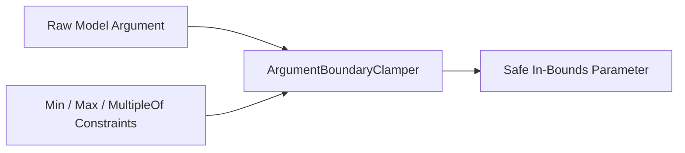

# genpark-argument-boundary-clamping-filter-skill

Safe parameter boundary enforcement clamping out-of-range numerical arguments and truncating over-length strings.

## Architecture

## Features
- **Anti-Buffer-Overflow**: Enforces maximum string lengths.
- **Pure Python**: 100% standard library.
